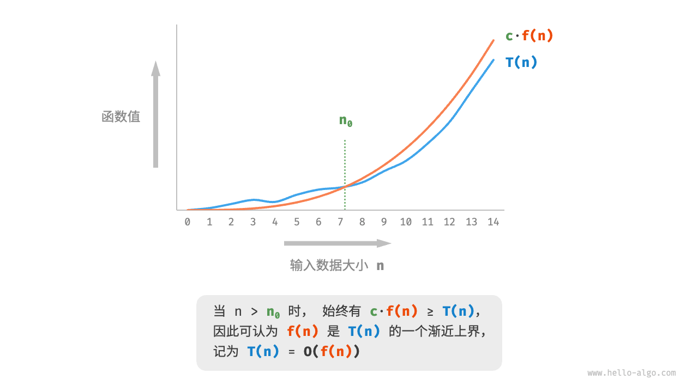

# 复杂度分析 - Complexity Analysis

复杂度分析是一种估算方法, 全称是 "渐进复杂度分析 (asymptotic complexity analysis)".

**它描述了随着输入数据大小的增加, 算法执行所需时间和空间的增长趋势.**

## 时间复杂度

时间复杂度分析统计的不是算法运行时间, **而是算法运行时间随着数据量变大时的增长趋势**.

### 函数渐进上界

这是一个数学定义, 用于描述一个函数的增长趋势. 用它来计算时间复杂度.

数学定义: 若存在正实数 $ c $ 和正整数 $ n_0 $, 使得对于所有 $ n \geq n_0 $, 有 $ T(n) \leq c \cdot f(n) $, 则可认为 $ f(n) $ 给出了 $ T(n) $ 的一个渐进上界, 记为 $ T(n) = O(f(n)) $.



### 推算方法

根据定义, 确定 $f(n)$ 之后, 我们便可得到时间复杂度 $O(f(n))$. 那么如何确定渐进上界 $f(n)$呢? 总体分为两步: 统计操作数量, 判断渐进上界.

**第一步: 统计操作数量**

1. **忽略 $T(n)$ 中的常数项**. 因为他们都与 $n$ 无关.
2. **省略所有系数**. 比如, 循环 $2n$ 次, $5n + 1$次等, 都可以简化记为 $n$ 次.
3. **循环嵌套时使用乘法**.

```python
def algorithm(n: int):
    a = 1      # +0（技巧 1）
    a = a + n  # +0（技巧 1）
    # +n（技巧 2）
    for i in range(5 * n + 1):
        print(0)
    # +n*n（技巧 3）
    for i in range(2 * n):
        for j in range(n + 1):
            print(0)
```

$$
T(n) = n + n^2
$$

**第二步: 判断渐进上界**

**时间复杂度由 $T(n)$ 中最高阶的项来决定**. 这是因为在 $n$ 趋于无穷大时, 最高阶的项将发挥主导作用, 其他项的影响都可以忽略.

所以时间复杂度为 $O(n^2)$

### 常见类型

$$
O(1) < O(\log n) < O(n) < O(n\log n) < O(n^2) < O(2^n) < O(n!)
$$

这里详细讲解一下冒泡排序的时间复杂度的算法, 因为这里涉及一个 "等差数列" 求和公式.

**具体例子：列表有5个元素（n=5）**

```python
def bubble_sort(num: list[int]) -> int:
    """平方阶（冒泡排序）"""
    count = 0  # 计数器
    # 外循环：未排序区间为 [0, i]
    for i in range(len(num) - 1, 0, -1):
        # 内循环：将未排序区间 [0, i] 中的最大元素交换至该区间的最右端
        for j in range(i):
            if num[j] > num[j + 1]:
                # 交换 num[j] 与 num[j + 1]
                tmp: int = num[j]
                num[j] = num[j + 1]
                num[j + 1] = tmp
                count += 3  # 元素交换包含 3 个单元操作
    return count
```

**逐步展开过程**

让我们一步一步展开内层循环的执行过程：

1. **第一轮**（外层循环，i=4）：
   - 内层循环运行 4 次： \( (0,1), (1,2), (2,3), (3,4) \)
   - 总计 4 次

2. **第二轮**（外层循环，i=3）：
   - 内层循环运行 3 次： \( (0,1), (1,2), (2,3) \)
   - 总计 3 次

3. **第三轮**（外层循环，i=2）：
   - 内层循环运行 2 次： \( (0,1), (1,2) \)
   - 总计 2 次

4. **第四轮**（外层循环，i=1）：
   - 内层循环运行 1 次： \( (0,1) \)
   - 总计 1 次

总的内层循环次数：

\[
4 + 3 + 2 + 1 = 10
\]

内循环次数等于: $(n-1) + (n-2) + ... + 1 = \frac{n \cdot (n-1)}{2}$
