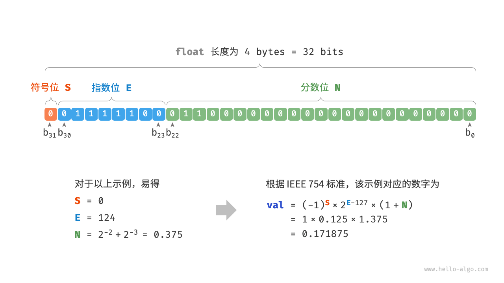

# 数据结构

## 数字编码

### 原码, 反码, 补码

**数字是以 "补码" 形式存储在计算机中的.**

- 原码 (sign-magnitude): 最高位是符号位, 0 表示正数, 1 表示负数, 其余为表示数字值.
- 反码 (one's complement): 正数的反码就是原码, 负数的反码是符号位不变, 其余位取反.
- 补码 (two's complement): 正数的补码就是原码, 负数的补码是反码加 1.

> `sign-magnitude` 这个单词表示了原码的组合方式, 符号-数值大小.
> `one's complement` 中 "one's" 可以理解成 "一次补足".
> `two's complement` 中 "two's" 可以理解成 "二次补足".

**为什么计算机要使用 "补码" 呢?**

原码计算不方便, **负数的原码不能直接用于运算**. 此点很好理解, 因为负数第一位是符号位, 且是 1, 直接计算会导致计算错误. 比如: $1 + (-2)$ 用原码结算结果为 $-3$.

为了解决原码计算问题, 引入了 "反码". 用反码计算后再转回原码, 上面的结果就会是正确的 $-1$.

但是反码没有解决正负零的问题, 所谓正负零问题就是零在原码和补码中有两种表示方式, 这会导致对零的比较运算中需要更多的判断, 从而导致计算机的运算效率.

为了解决正负零问题, 引入了 "补码". 负零的补码与正零的补码相同, 这样就解决了正负零的问题.

最后, 为什么取值范围负数会多一个值呢? 这是因为补码 `1000 0000` 是一个例外, 它没有对应的原码. 根据转换规则其反码是 `0111 1111`, 其原码是 `0000 0000`. 这显然是矛盾的, 因为这表示其原码是数字 $0$, 数字 $0$ 的补码应该是其自身才对. 因此计算机规定这个特殊的补码 `1000 0000` 代表 $-128$. 实际上, $(-1) + (-127)$ 在补码下的计算结果就是 $-128$.

$$
\begin{align*}
    (-127) + (-1)
    &\rightarrow 1111 1111 (\text{原码}) + 1000 0001 (\text{原码}) \\
    &= 1000 0000 (\text{反码}) + 1111 1110 (\text{反码}) \\
    &= 1000 0001 (\text{补码}) + 1111 1111 (\text{补码}) \\
    &= 1000 0000 (\text{补码})
    &\rightarrow -128
\end{align*}
$$

### 浮点数编码

浮点数编码有些复杂, 下面我们使用单精度32位浮点数来解释浮点数编码规则.

根据 `IEEE 754` 标准, 32-bit 长度的 `float` 由以下三个部分构成.

- 符号位 $S$: 占 1 位, 对应 $b_{31}$
- 指数位 $E$: 占 8 位, 对应 $b_{30-23}$
- 分数位 $N$: 占 23 位, 对应 $b_{22-0}$

二进制 `float` 对应值的计算方法为:

$$
val = (-1)^{S} \times 1.N \times 2^{E-127}
$$

其中:

- $S \in \{0, 1\}$
- $E \in \{1,2,...,254\}$
- $1.N = (1 + \sum\limits_{i=1}^{23}{b_{23-i}{2^{-i}}})$

- $S = 0$, 表示是正数
- $E = 0111 1100 \rightarrow 124$
- $1.N = 1.011000\cdots \rightarrow (1 + 0 \times 2^{-1} + 1 \times 2^{-2} + 1 \times 2^{-3} + 0 + ... + 0) = 1.375$
- $val = (-1)^{0} \times 1.375 \times 2^{124-127} = 1 \times 1.375 \times 0.125 = 0.171875$

**这里需要特别注意: $E$ 的取值范围中没有 $0$ 和 $255$, 这是因为他们具有特殊的含义.**

| 指数位 $E$ | 分数位 $N$  | 分数位 $N \neq 0$  | 计算公式  |
|---|---|---|---|
| $0$ | $\pm{0}$  | 次正规数  | $(-1)^S \times 2^{-126} \times (0.N)$  |
| $1,2,...,254$  | 正规数  | 正规数  | $(-1)^S \times 2^{E-127} \times (1.N)$  |
| $255$  | $\pm\infty$  | NaN  |   |
