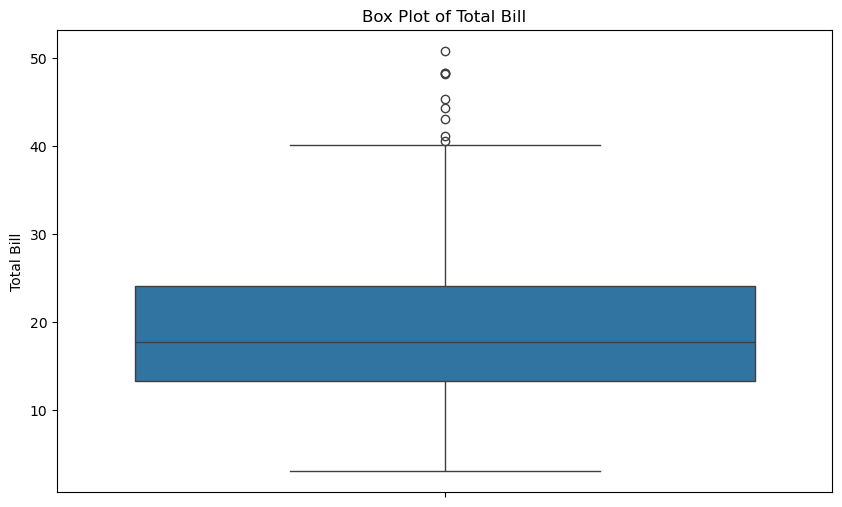
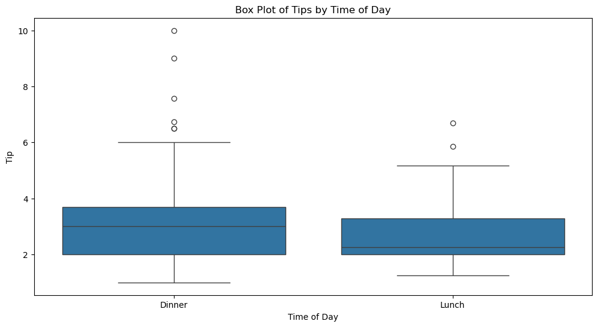

# 箱线图 - Box Plot

箱线图（Box Plot），也称为盒形图，是一种用于显示数据分布概况的统计图表。它通过五个统计量来描述数据集的分布特征：最小值、第一四分位数、中位数、第三四分位数和最大值。箱线图还可以显示异常值（outliers）。下面我们结合 Seaborn 的 `tips` 数据集来解释箱线图的含义。

### 数据集和基本描述

首先，加载 Seaborn 的 `tips` 数据集：


```python
import seaborn as sns
import matplotlib.pyplot as plt
import pandas as pd

# 加载数据集
tips = pd.read_csv("../../data/tips.csv")
```

### 绘制箱线图

使用 Seaborn 绘制 `total_bill` 的箱线图：


```python
# 绘制箱线图
plt.figure(figsize=(10, 6))
sns.boxplot(y=tips["total_bill"])
plt.title("Box Plot of Total Bill")
plt.ylabel("Total Bill")
plt.show()
```


    

    


### 箱线图的构成

箱线图由以下部分构成：

1. **中位数（Median）**：箱体内的一条横线，表示数据的中间值。
2. **第一四分位数（Q1, 25th Percentile）**：箱体的下边缘，表示数据的下四分位数。
3. **第三四分位数（Q3, 75th Percentile）**：箱体的上边缘，表示数据的上四分位数。
4. **四分位距（IQR, Interquartile Range）**：即 Q3 - Q1，表示中间 50% 数据的范围。
5. **须（Whiskers）**：从箱体延伸出去的线，通常表示范围从 Q1 - 1.5 * IQR 到 Q3 + 1.5 * IQR 之间的数据。
6. **异常值（Outliers）**：位于须之外的点，表示异常值或极端值。

### 解读箱线图

结合 `total_bill` 的箱线图，我们可以解读如下信息：

1. **中位数**：箱体内的横线表示账单金额的中位数，大约是 18 美元。
2. **四分位数**：
   - 第一四分位数（Q1）：大约是 13 美元。
   - 第三四分位数（Q3）：大约是 24 美元。
3. **四分位距（IQR）**：约为 24 - 13 = 11 美元。
4. **须**：
   - 下须：从 Q1 延伸到 Q1 - 1.5 * IQR，大约是 13 - 1.5 * 11 = -3.5 美元（由于不能是负值，因此下须起点是账单金额的最小值）。
   - 上须：从 Q3 延伸到 Q3 + 1.5 * IQR，大约是 24 + 1.5 * 11 = 40.5 美元。
5. **异常值**：位于上须之外的点表示异常值。例如，超过 40.5 美元的账单金额被视为异常值。

### 箱线图的优点

1. **概括数据分布**：箱线图提供了数据分布的五个关键统计量，帮助快速了解数据的中心趋势和离散程度。
2. **识别异常值**：箱线图可以有效识别并显示异常值。
3. **比较数据集**：通过绘制多个箱线图，可以比较不同数据集的分布特征。

### 示例：比较不同时间段的小费分布


```python
# 按不同时间段绘制小费的箱线图
plt.figure(figsize=(12, 6))
sns.boxplot(x="time", y="tip", data=tips)
plt.title("Box Plot of Tips by Time of Day")
plt.xlabel("Time of Day")
plt.ylabel("Tip")
plt.show()
```


    

    


通过比较不同时间段（午餐和晚餐）的箱线图，我们可以看到：
- **中位数**：晚餐的小费中位数高于午餐。
- **四分位数和 IQR**：晚餐的小费分布范围较午餐更广，四分位距也更大。
- **异常值**：晚餐的小费存在更多的异常值，尤其是高额小费。

### 总结

箱线图是一种强大且直观的工具，用于描述数据分布、识别异常值和比较不同数据集。通过五个关键统计量（最小值、第一四分位数、中位数、第三四分位数和最大值）以及异常值的显示，箱线图可以帮助我们快速理解数据的中心趋势和离散程度。在数据分析和可视化中，箱线图具有广泛应用。

## 计算箱线图统计量

1. 最小值
2. Q1, 第一四分位数
3. 中位数
4. Q3, 第三四分位数
5. 最大值
6. IQR, 四分位距
7. Whiskers, 触须


```python
import pandas as pd

tips = pd.read_csv("../../data/tips.csv")

data = tips["total_bill"]

# 最小值
min_value = data.min()
# Q1
q1 = data.quantile(0.25)
# 中位数
median = data.median()
# Q3
q3 = data.quantile(0.75)
# 最大值
max_value = data.max()
# 四分位距
IQR = q3 - q1
# 须
lower_whisker = q1 - 1.5 * IQR
upper_whisker = q3 + 1.5 * IQR

print(f"min: {min_value}")
print(f"q1: {q1}")
print(f"median: {median}")
print(f"q3: {q3}")
print(f"max: {max_value}")
print(f"IQR: {IQR}")
print(f"lower_whisker: {lower_whisker}")
print(f"upper_whisker: {upper_whisker}")
```

    min: 3.07
    q1: 13.3475
    median: 17.795
    q3: 24.127499999999998
    max: 50.81
    IQR: 10.779999999999998
    lower_whisker: -2.8224999999999945
    upper_whisker: 40.29749999999999

